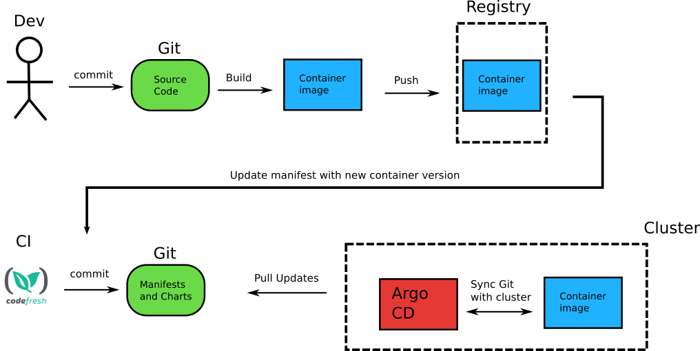

# GitOps

Why, What & How

---

## Why?

Systems Development Life Cylce (SDLC)

  <a href="https://en.wikipedia.org/wiki/Systems_development_life_cycle">Wikipedia: Systems development life cycle</a>

---

## What is GitOps?

> GitOps is an operational framework that takes DevOps best practices
> used for application development such as version control, collaboration,
> compliance, and CI/CD, and applies them to infrastructure automation.

  <a href="https://about.gitlab.com/topics/gitops/">GitLab: What is GitOps?</a>

---

### DevOps?

> DevOps is a combination of software development (dev) and operations (ops)
> by facilitating a culture of collaboration and shared responsibility.

  <a href="https://about.gitlab.com/topics/devops/">GitLab: What is DevOps?</a>

---

### Core DevOps Principles

1. Automation of the software development lifecycle
2. Collaboration and communication
3. Continuous improvement and minimization of waste
4. Hyperfocus on user needs with short feedback loops

  <a href="https://about.gitlab.com/topics/devops/">GitLab: What is DevOps?</a>

---

### DevOps SDLC

  <a href="https://about.gitlab.com/topics/devops/">GitLab: What is DevOps?</a>

---

### Continuous Integration

> Continuous Integration is a software development practice where members of a team integrate their work frequently,
> usually each person integrates at least daily - leading to multiple integrations per day.
> Each integration is verified by an automated build (including test) to detect integration errors as quickly as possible.

  <a href="https://martinfowler.com/articles/continuousIntegration.html">Martin Fowler: Continuous Integration</a>

---

### Continuous Delivery

> Continuous Delivery is a software development discipline where you build software in such a way that the software can be released to production at any time.

  <a href="https://martinfowler.com/bliki/ContinuousDelivery.html">Martin Fowler: ContinuousDelivery</a>

---

### Continuous Deployment

> Continuous Deployment means that every change goes through the pipeline and automatically gets put into production, resulting in many production deployments every day.

  <a href="https://martinfowler.com/bliki/ContinuousDelivery.html">Martin Fowler: ContinuousDelivery</a>

---

### CI/CD Fundamentals

1. A single source repository
2. Frequent check-ins to main branch (HEAD)
3. Automated builds
4. Self-testing builds
5. Frequent iterations
6. Stable testing environments
7. Maximum visibility
8. Predictable deployments anytime

  <a href="https://about.gitlab.com/topics/ci-cd/">GitLab: What is CI/CD?</a>

---

### CI/CD Pipeline Example

  <a href="https://docs.gitlab.com/ee/ci/introduction/">GitLab: CI/CD concepts</a>

---

### GitOps is a way to achieve continuous deployment of cloud-native applications

---

### GitOps Principles

1. Declarative
2. Versioned and Immutable
3. Pulled Automatically
4. Continuously Reconciled

---

#### Declarative

A system managed by GitOps must have its desired state expressed declaratively

---

#### Versioned and Immutable

Desired state is stored in a way that enforces immutability, versioning and retains a complete version history

---

#### Pulled Automatically

Software agents automatically pull the desired state declarations from the source

---

#### Continuously Reconciled

Software agents continuously observe actual system state and attempt to apply the desired state

---

### Key Benefits of GitOps

1. Increased productivity
2. Enhanced developer experience
3. Improved audibility
4. Higher reliability
5. Consistency and standardization
6. Stronger security guardrails
7. Faster development
8. Better ops
9. Easier compliance and auditing

  <a href="https://www.weave.works/technologies/gitops/#key-benefits-of-gitops">Weaveworks: Guide To GitOps</a>

---

### GitOps vs DevOps

> While DevOps is a general philosophy of how teams should work (i.e., best practices applicable across an organization’s processes),
> GitOps is a way to effectively implement DevOps. It is a method that depends on a specific tool for source control (Git) and is more goal-oriented.

  <a href="https://codefresh.io/learn/gitops/">Codefresh: What Is GitOps? How Git Can Make DevOps Even Better</a>

---

## How? Tooling

* Argo CD
* Flux CD
* JenkinsX
* ...

---

### How: Argo CD

---

### Argo CD

Demo

---

### Gitopsify Everyting

Kubernetes Cluster Deployment with Argo CD + Crossplane

---

## Sources 1/2

* <https://www.gitops.tech/>
* <https://opengitops.dev/>
* <https://about.gitlab.com/topics/gitops/>
* <https://about.gitlab.com/topics/devops/>
* <https://about.gitlab.com/topics/ci-cd/>
* <https://www.ibm.com/topics/devops>
* <https://www.ibm.com/topics/continuous-integration>
* <https://www.ibm.com/topics/continuous-delivery>

---

## Sources 2/2

* <https://martinfowler.com/articles/continuousIntegration.html>
* <https://martinfowler.com/bliki/ContinuousDelivery.html>
* <https://codefresh.io/learn/gitops/>
* <https://codefresh.io/learn/ci-cd/ci-vs-cd-differences-similarities-and-best-practices/>
* <https://www.weave.works/technologies/gitops/>
